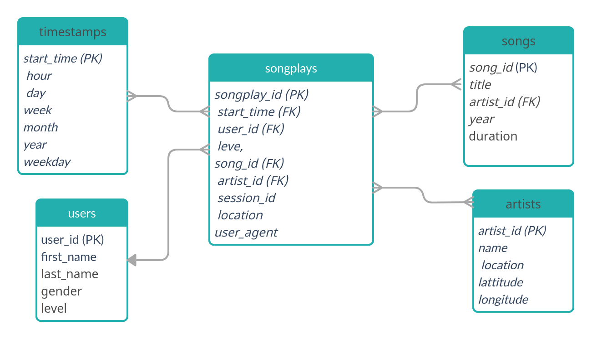

# Schema for songplay analysis

This project creates a database of songs and of user activity on the Sparkify streaming app. It arranges the raw information in a star-schema database centered on song plays.

# Database structure

To simplify the database queries, we choose to follow a star design. The database thus contains a fact table, **songlays**, which contains information about each song played by users through Sparkify streaming app. The database also contains the following dimension tables :
- **users** : contains information about Sparkify users
- **songs** : contains song information
- **artists** : contains information about the songs' artists
- **time** : contains information about the playtime of songs through the app.

Sparkify analytics team is particularly interested in knowing what songs users are listening to. The **songplays** table is what is hence of interest to them, and is constantly updated as log data is retrieved from the streaming app. It is thus a fact table. The other tables gives more detail information about some elements of the fact table (i.e. users, songs, artist, and playtime). These are thus dimension tables.

Since there are very few users (102) compared to the total number of songs and songplays (around 10000 each), we use a DIST ALL strategy for the user table. For the other tables, we use `song_id` as a sortkey and distkey for tables `songs` and `songplays`. For `timestamps` and `artists` we use the primary keys to sort and distribute the tables. 

# Installation

## Prerequisites

This project uses python3 and postgresql.
Python libraries to install :
- `psycopg2`
- `configparser`
- `importlib`

## AWS redshift cluster
This project runs on a [AWS Redshift cluster](https://aws.amazon.com/redshift). Please follow instructions on [Udacity's redshift cluster tutorial](https://classroom.udacity.com/nanodegrees/nd027/parts/69a25b76-3ebd-4b72-b7cb-03d82da12844/modules/38c9fd5f-315b-4648-8b27-f3947c936a15/lessons/21d59f40-6033-40b5-81a2-4a3211d9f46e/concepts/fad03fb3-ce48-4a69-9887-4baf8751cae3)
to parametrise and launch the cluster.
Once the cluster created, enter your cluster parameters into a configuration file `dwh.cfg`. We provide you with a template `dwh_TEMPLATE.cfg` to fill (don't forget to move the file from `dwh_TEMPLATE.cfg` to `dwh.cfg` ).

**__BE CAREFUL TO KEEP dwh.cfg SECRET !!! IN PARTICULAR, DON'T PUT IT IN A PUBLIC REPOSITORY.__**

## Data
The data used to populate the database is stored in S3 buckets :
`s3://udacity-dend/song_data`

`s3://udacity-dend/log_data`

## How to run the code

To create the sparkifydb database, open a terminal and run 

    python create_tables.py
    
To populate the database with data, run in the terminal :
    
    python etl.py
    
The `etl` phase will first copy raw data from S3 bucket into staging databases. Then, the staging 

### Example queries
The star database design makes the database queries easy. For instance, if the analytics teams want to know what songs in the database have been played through the app, they can issue a simple sql query. 
Exemples of queries on the database are given in `songplayDB_example.ipynb`

# Changelog

# v1.0
First version submitted to Udacity platform.